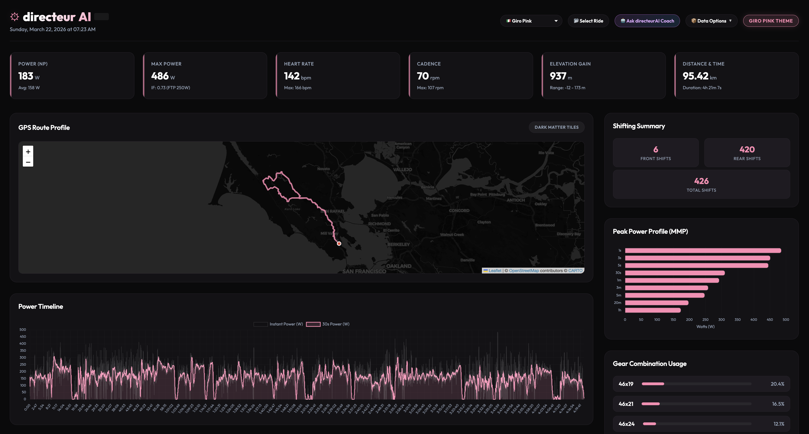
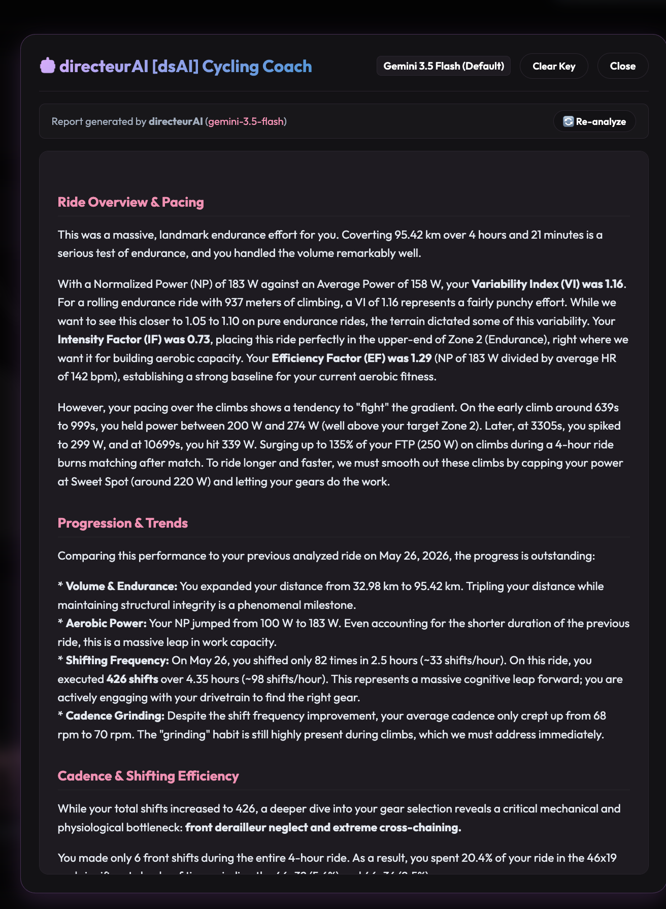

# directeurAI 🚴‍♂️🤖

**directeurAI** is a local-first analytics dashboard and AI cycling coach that parses `.FIT` telemetry files, calculates advanced cycling metrics, and lets you ask an AI coach about your ride performance.



---

## Features

### 1. Dynamic Month-Based Styling
The entire dashboard changes its visual theme dynamically based on the month the ride was recorded. Mid-summer rides get high-energy vibrant pinks, while winter rides shift to icy, glassmorphic blues, and autumn rides adapt to warm, golden hues.

### 2. Interactive Telemetry Visualizations
*   **Dual-Y Charts**: Sync and compare power output against heart rate, cadence, speed, and altitude.
*   **Shifting Frequency & Gear Ratios**: Decodes Shimano/SRAM gear indexes using custom gear config definitions to display actual ratios and shifts.
*   **Power Curve & Zones**: Analyzes Normalized Power (NP), average power, max power, and power distribution zones.

### 3. Hammerhead Dashboard Sync
*   **OAuth 2.0 Integration**: Authorize directly with the Hammerhead account using the developer client credentials and the `activity:read` scope.
*   **Automatic Token Refresh**: Auto-handles authorization codes, access token refreshes, and API retries.
*   **Paginated Activity Indexing**: Browse through your entire ride history with intuitive `Next` and `Prev` navigation buttons.
*   **Automatic Cache Ingestion**: Automatically caches Hammerhead `.FIT` downloads locally for immediate access.

### 4. Direct-to-Browser AI Coaching
*   **Private & Secure**: The AI Coach operates completely client-side in your browser. Paste your Google Gemini API key once; it is saved in browser `localStorage` and sent directly to Google's Gemini API endpoints (never stored or processed by intermediate servers).
*   **Ride-Contextual Prompts**: Automatically prompts Gemini with your ride statistics, climbing profile, gear selection patterns, and power zones to return a tailored coaching review.
*   **Flexible Model Selection**: Support for `Gemini 3.5 Flash`, `Gemini 2.5 Pro`, and legacy options.



---

## Getting Started

### Prerequisites
*   [Go compiler](https://go.dev/doc/install) (Go 1.18 or newer recommended).
*   A Google Gemini API key (for the AI coaching feature).
*   Hammerhead Client ID and Secret (for Hammerhead integration).

### Build Instructions
Run the default build target using the provided `Makefile`:
```bash
make build
```
This compiles the code and generates the `directeur` executable in the root directory.

### Running directeurAI

#### 1. CLI Analysis Mode
To parse a `.FIT` file directly from the terminal and export static analysis outputs:
```bash
./directeur -input example.fit -config config.json
```
This generates:
*   `ride_analysis.json`: The complete parsed telemetry JSON schema.
*   `ride_dashboard.html`: The self-contained interactive dashboard HTML.

#### 2. Local Server/Viewer Mode
Start a local web server to browse Hammerhead rides, scan local folders, and view interactive dashboards:
```bash
make serve
```
or run directly with custom settings:
```bash
./directeur -serve -port 8080 -config config.json
```
Once running, navigate to [http://localhost:8080/](http://localhost:8080/) in your web browser.

---

## Configuration

`directeur` looks for configuration files in the following order of priority:
1.  A custom configuration path specified by the `-config` flag.
2.  `~/.directeur.config.json` (inside your user home directory).
3.  `config.json` in the current working directory.

See [config.json.example](file:///Users/rjs/go/src/github.com/robshakir/directeur/config.json.example) for a template:

```json
{
  "front_gears": [33, 46],
  "rear_gears": [36, 32, 28, 24, 21, 19, 17, 15, 13, 12, 11, 10],
  "local_directory": "/path/to/your/downloads/or/fits",
  "hammerhead_api": {
    "enabled": false,
    "client_id": "your-developer-client-id",
    "client_secret": "your-developer-client-secret",
    "auth_token": "",
    "refresh_token": "",
    "download_dir": "/path/to/local/cache/folder"
  }
}
```

*   **`front_gears` & `rear_gears`**: Integer tooth counts matching your chainrings and cassette sprocket teeth order to map FIT gear indexes to teeth ratios.
*   **`local_directory`**: A local folder directory containing raw `.fit` files. The dashboard scans this directory and lists all rides.
*   **`hammerhead_api`**: Credentials obtained from the Hammerhead developer console. Keep `enabled` set to `true` to authenticate.

---

## Integrations

### Setting Up Hammerhead Account Connection
1. Set up client developer credentials inside Hammerhead.
2. Add the `client_id` and `client_secret` to your configuration file, and ensure `"enabled": true` is set.
3. Start the dashboard server (`make serve`) and visit the webpage.
4. If your account is not linked, click **"Link Hammerhead Account"** in the sidebar. This redirects you to the Hammerhead login and consent screen.
5. Once authorized, Hammerhead redirects back to `http://localhost:8080/callback`, where the server registers the authorization code, stores access tokens, and begins fetching your rides list.

### Activating the Gemini AI Coach
1. Get a free API key from the Google AI Studio console.
2. In the dashboard sidebar, click **"Ask directeurAI Coach"**.
3. Paste your Gemini API key and select your preferred model.
4. Click **"Generate Coaching Report"** to run a comprehensive analysis of your power duration curve, cadence efficiency, and gear selections.
